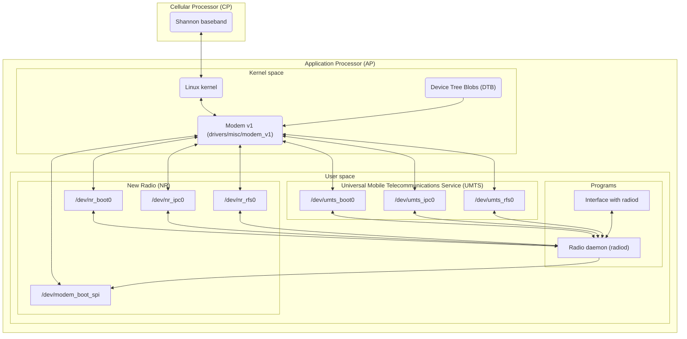
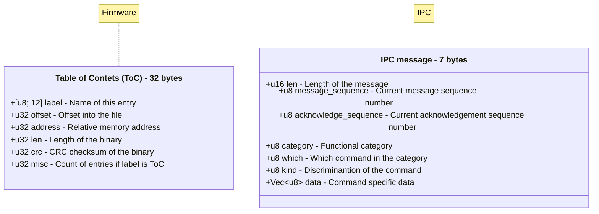

# Radio

Utilities, and daemon for interfacing with the Shannon baseband. The following is an overview of the stack:

Despite the naming, UMTS devices are responsible for 2G GSM, 3G UMTS, 4G LTE, and NR is only 5G NR.

Base structure overview:

# Links

- [How to boot the Samsung Galaxy S7 modem with plain Linux kernel interfaces only](https://eighty-twenty.org/2020/09/10/booting-samsung-galaxy-s7-modem)
  - Demonstrates the Shannon310 boot process (`/dev/umts_boot0`), and describes the ToC format.
- [LineageOS Exynos9820 kernel sources](https://github.com/LineageOS/android_kernel_samsung_exynos9820/tree/lineage-21/drivers/misc/modem_v1)
  - The Modem v1 driver.
- [Reversing & Emulating Samsung's Shannon Baseband](https://hardwear.io/netherlands-2020/presentation/samsung-baseband-hardwear-io-nl-2020.pdf)
  - Demonstrates various details of the Shannon baseband, and describes the ToC format.
- [Replicant's libsamsung-ipc](https://redmine.replicant.us/projects/replicant/wiki/Libsamsung-ipc)
  - Definitions of various IPC commands, full RIL stack for older devices.
